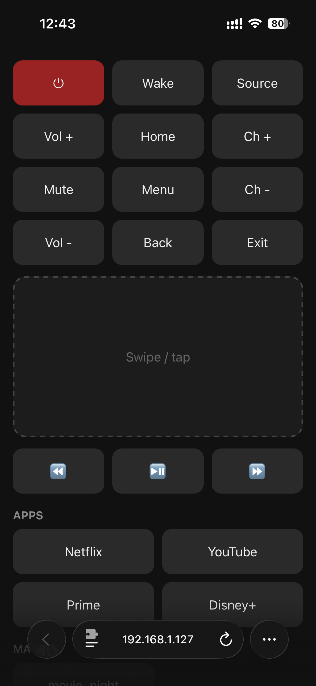

# Samsung TV Web Remote

A phone-friendly web remote for Samsung TVs (2020+, Tizen on port 8002), with
macros, favorite-app launch, a gesture pad, and Wake-on-LAN. It is a small Flask
server that talks to the TV over its local WebSocket API. Run it on anything on
your TV's network: bare metal / Raspberry Pi, Docker, or Kubernetes.

<p align="center">
  
</p>

## Requirements

- A Samsung TV (2020 or newer) reachable on your LAN.
- On the TV, enable **Wake-on-LAN / "Power On with Mobile"** in the network
  settings if you want to turn it on from standby.
- The server must sit on the **same LAN/subnet as the TV** (the WebSocket is a
  direct local connection, and Wake-on-LAN is an L2 broadcast that does not cross
  subnets or NAT).

## Configuration

All configuration is a single YAML file. Copy the example and edit it:

```bash
cp config.example.yaml config.yaml
```

| Key            | What it is                                                      |
|----------------|-----------------------------------------------------------------|
| `tv.host`      | TV IP address (find it in the TV's network status screen).      |
| `tv.port`      | `8002` for 2020+ models (TLS WebSocket). Leave as is if unsure. |
| `tv.name`      | Name shown on the TV's "Allow this device?" prompt.             |
| `tv.mac`       | TV MAC address, required only for Wake-on-LAN.                   |
| `tv.token_file`| Path where the pairing token is stored (see below).            |
| `apps`         | Favorite apps for the launch grid: `{ name, id }` (Tizen app IDs). |
| `macros`       | Named sequences of keys / app launches / delays / `wol`.         |

**Pairing:** the first key press triggers an "Allow this device?" prompt on the
TV. Accept it once. The token is written to `tv.token_file` and reused after that,
so that path must be persistent (a real file on bare metal, a mounted volume in
Docker/Kubernetes).

Optional environment variable: `LOG_LEVEL` (`DEBUG` | `INFO` | `WARNING` |
`ERROR`, default `INFO`). `CONFIG_PATH` selects the config file (default
`config.yaml`).

## Run: bare metal / Raspberry Pi

```bash
python -m venv .venv && . .venv/bin/activate
pip install -r requirements.txt          # or requirements-dev.txt to also run tests
cp config.example.yaml config.yaml       # edit tv.host + tv.mac; set tv.token_file to e.g. ./token.txt
CONFIG_PATH=config.yaml gunicorn --bind 0.0.0.0:5000 --workers 1 wsgi:app
```

Open `http://<server-ip>:5000` on your phone (same WiFi). Use `--workers 1`: the
pairing token and TV WebSocket are a single shared resource.

## Run: Docker

```bash
docker build -t samsung-remote:latest .

docker run --network host \
  -v "$PWD/config.yaml:/config/config.yaml" \
  -v samsung-remote-data:/data \
  -e CONFIG_PATH=/config/config.yaml \
  samsung-remote:latest
```

- `--network host` is required: Wake-on-LAN is an L2 broadcast and will not cross
  the default Docker bridge network.
- Mount a volume at `/data` (and point `tv.token_file` at `/data/token.txt`) so the
  pairing token survives container restarts.

## Run: Kubernetes (Helm)

A Helm chart is provided in `chart/`. Key requirements:

- Cluster nodes must be on the **same LAN/subnet as the TV**. The Deployment runs
  with `hostNetwork: true` so the Wake-on-LAN packet leaves the node's real
  interface (the pod overlay network drops L2 broadcasts).
- The pairing token is stored on a PVC so it survives pod restarts.

Configure via Helm values (see `chart/values.yaml` for all options):

| Value             | Purpose                                              |
|-------------------|------------------------------------------------------|
| `image.repository`, `image.tag` | Where your built image lives.          |
| `tv.host`, `tv.mac`, `tv.name`  | TV connection + Wake-on-LAN.           |
| `ingress.enabled`, `ingress.host`, `ingress.className` | Optional ingress. |
| `logLevel`        | App log level (default `INFO`).                      |
| `apps`, `macros`  | Favorite apps and macros.                            |

Build and push the image to a registry your cluster can pull from, then:

```bash
helm upgrade --install samsung-remote chart \
  --namespace samsung-remote --create-namespace \
  --set image.repository=<your-registry>/samsung-remote \
  --set image.tag=<tag> \
  --set tv.host=<TV_IP> \
  --set tv.mac=<TV_MAC> \
  --set ingress.host=<dns-name>

kubectl -n samsung-remote rollout status deploy/samsung-remote
```

To update, build a new image, then re-run `helm upgrade` with the new
`image.tag`. Uninstall with `helm uninstall samsung-remote -n samsung-remote`
(the token PVC is retained; delete it explicitly if you want a clean slate).

### GitOps (Argo CD)

`argo/application.yaml` is a sample Argo CD `Application` that deploys the Helm
chart from this repo and exposes the values above as Argo parameters (editable in
the Argo UI under the app's Parameters tab). Edit `repoURL`, the image and `tv.*`
parameters for your environment, then:

```bash
kubectl apply -f argo/application.yaml -n argocd
```

The image tag is intentionally driven by `chart/values.yaml` (not pinned as an
Argo parameter), so a CI job that bumps the tag in git triggers an automatic
re-rollout. `.github/workflows/build.yml` is a sample build pipeline; adapt the
registry, runner, and build tool to your setup.

## Tests

```bash
pip install -r requirements-dev.txt
pytest
```

## Keys

Standard Tizen key set: `KEY_POWER`, `KEY_UP/DOWN/LEFT/RIGHT`, `KEY_ENTER`,
`KEY_VOLUP/VOLDOWN/MUTE`, `KEY_CHUP/CHDOWN`, `KEY_0`-`KEY_9`, `KEY_HDMI1`-`KEY_HDMI4`,
`KEY_PLAY/PAUSE/STOP/REWIND/FF`, and more.
